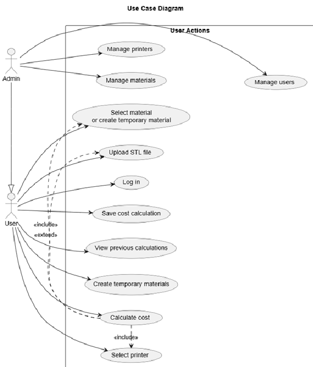
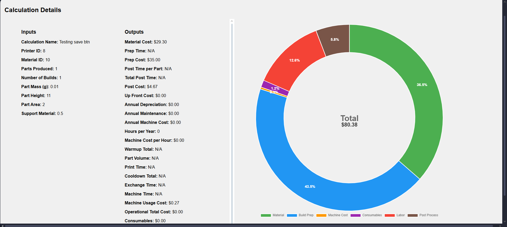

# 1 Introduction and Goals 

Nexttech 3D print calculator calculates cost for 3D print projects and saves the calculation results for later reporting. Created to support print specialists at NEXTTECH.

Main goal is to give consistent cost reports for 3d print jobs.

## Requirements Overview 

- Specialist selects/fills the input areas

- Nexttech calculates the cost by putting the inputs through calcuation logic.

- Nexttech creates a result report showing the cost and the cost breakdown.

|Id| Requirement               | Explanation                           | 
|:---:| :----------------         | :------                               | 
|F1| Perform calculation       | Calculate cost according to user input| 
|F2| Show calculation results  |                                       | 
|F3| Save calculation results  | Save results for reviewing again      |
|F4| Manage changes            | Add, view, delete, update printers, materials, users| 

The overall goal of Nexttech Calculator is to create neat,clear and detailed reports, showing all the expenses for specific print jobs. Below you find a example report.

## Quality Goals 

|ID|Description|
|--|-----------|
|1|The calculator must correctly compute cost based on filament weight (grams) and material cost per kg.|
|2|The calculator must correctly account for machine run-time costs|
|3|The calculator must include labor/setup/post-processing time in the cost output.|
|4|The calculator must support both single-object and batch jobs, dividing shared costs accurately.|
|5|The calculator must generate results instantly|

## Stakeholders 

|Role/Name|Contact|Expectations|
|--|--|--|
|developer|Sinan|expects clear guidance on what inputs are required and how costs are calculated.|
|teacher|Stefan|expects clarity in design choices, correctness, and alignment with project requirements.|
|customer|Martin|expects reliable calculations, transparency of cost breakdown, and possibly batch-job support.|
|students at customer|students|expect easy-to-use interface, clear inputs, and understandable outputs.|

# 2 Architecture Constraints 

--to be filled--

# 3 Context and Scope

## Business Context 

//Create uml diagram//

|Neighbour|Description|
|--|--|
|user|Uses the calculator to generate quotes for customers, including labor and overhead|
|input parameters|Required input data and printer/material choice|
|report|Calculator produces a detailed cost breakdown report|
|customer|Receives a quote generated from the calculator but does not interact with it directly|

## Technical Context

//Create uml diagram//

|Node / Artifact|Description|
|--|--|
|calculator-development|Where development takes place (C# .NET)|
|calculator-service|Deployed and running instance of the Web API|
|artifact repository|GitHub repository storing the source code and packaged releases of the 3D Print Cost Calculator Web API.|
|user client|Browser or application where users input print parameters and request cost calculations via the API.|
|STL files|3D model files uploaded by users; the API parses them to extract volume/weight information.|
|database|Stores printer profiles, materials, user accounts, and calculation history.
|report-generator|Component within API  that generates detailed cost breakdowns|

# 4 Solution Strategy 

--to be filled--

# 5 Building Block View 

--to be filled--

# 6 Runtime View 

--to be filled--

# 7 Deployment View 

--to be filled--

# 8 Cross-cutting Concepts 

--to be filled--

# 9 Architecture Decisions 

--to be filled--

# Quality Requirements 

**Quality tree**

|category|quality|description|
|--|--|--|
|Usability|Ease of Use|The calculator should be intuitive for all users, allowing easy entry of print parameters without extensive instruction|
||Ease of Learning|Standard functions should be quickly learnable|
|Performance|Accuracy|Calculations for cost (material, electricity, labor, overhead) shall be correct within ±2%|
||Speed|Calculations should complete in under 1 second for a single print and under 10 seconds for a batch of 50 prints|
|Robustness|Reliability|The calculator shall handle input variations and unexpected values without crashing|
|Maintainability|Modularity|Components (calculation engine, report generator) should be replaceable or extendable without affecting the whole system|
|Security|Data Integrity|Stored user data, material lists, and calculation results must be preserved without corruption|
|Cultural & Regional|Multilanguage|User interface texts should be adaptable for multiple languages via translation files|
|Operational & Environmental|Platform Compatibility|The calculator must function correctly on Windows, macOS, and supported web browsers|

**Quality Scenarios**

|Id|Scenario|
|--|--|
|SC1|A new user can perform a cost calculation after 5–10 minutes of instruction without external help.|
|SC2|Given valid inputs, the cost calculation output matches the expected manual calculation within ±2%.|
|SC3|A batch of 50 prints is processed and a cost report is generated in less than 10 seconds.|
|SC4|Inputting unusual or extreme values (very large STL file, high filament cost) does not crash the calculator and returns meaningful results.|
|SC5|The report generator can be replaced with a new module (e.g., PDF instead of Excel) without modifying the calculation engine.|
|SC6|Saved calculations remain correct after closing and reopening the system and cannot be accidentally overwritten.|
|SC7|With an appropriate translation file, all interface texts appear in the target language.|
|SC8|The calculator functions identically on Windows, macOS, and web browsers with no loss of functionality.|

# 11 Risks and Technical Debts 

--to bo filled--

# 12 Glossary 

